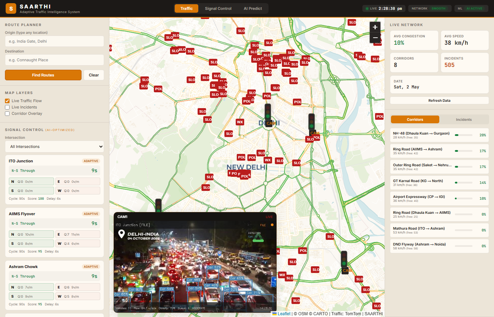
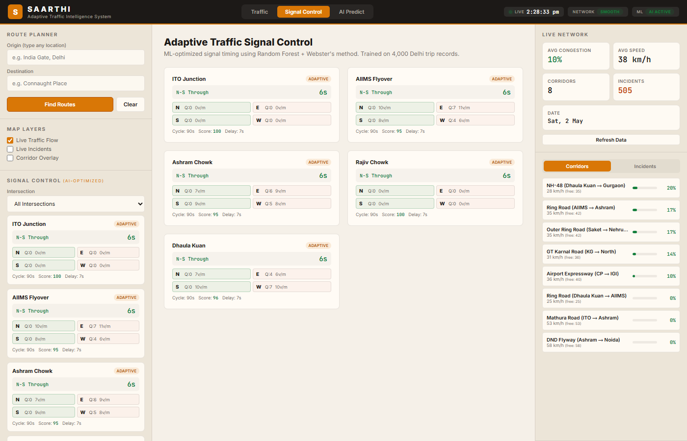
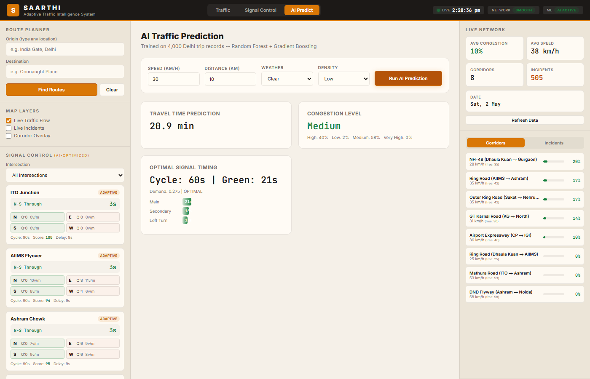

# SAARTHI - Adaptive Traffic Intelligence System

SAARTHI is a real-time, AI-powered traffic intelligence and adaptive signal control system built for complex urban environments like Delhi. By combining live computer vision, historical machine learning predictions, and real-time network mapping, SAARTHI aims to optimize traffic flow, reduce congestion, and improve fuel economy.



## 🌟 Key Features

### 1. Real-Time Computer Vision (YOLOv8)
- Uses the **YOLOv8n** model to process live camera feeds (local files, RTSP/HTTP streams, or YouTube live via `yt-dlp`).
- Detects multiple vehicle classes (Cars, Motorcycles, Buses, Trucks).
- Computes critical traffic metrics in real-time: **Vehicle Count, Flow Rate (v/min), Density, Queue Length, and Congestion Level**.
- Directly feeds live visual analytics into the intersection signal controllers.

### 2. AI-Optimized Signal Control
- Uses **Random Forest** and **Gradient Boosting** models trained on a custom dataset of 4,000 trip records.
- Dynamically predicts optimal **Signal Cycle Lengths** and **Green Phase Splits** based on real-time demand, vehicle density, weather, and time of day.
- Supports multi-phase intersection management (e.g., N-S Through, E-W Through, Turn phases).

### 3. Live Traffic Network Mapping
- Integrated with the **TomTom Traffic API** to poll live traffic flow and incident data (accidents, construction, waterlogging).
- Beautiful, high-performance mapping using **Leaflet.js** and the **CartoDB Positron** base layer.
- Displays live congestion heatmaps across major urban corridors (e.g., Ring Road, Outer Ring Road, NH-48).

### 4. Route Optimization & Fuel Economy
- Finds the most efficient routes taking into account real-time congestion and historical predictions.
- Calculates estimated fuel consumption and CO2 emissions for different vehicle types (Cars, EVs, Auto-rickshaws, Buses).

---

## 🏗️ Architecture

SAARTHI is built with a decoupled architecture, separating the heavy ML/AI processing from the fast, reactive frontend.

### Frontend (Client-Side)
- **Vanilla JavaScript & HTML5/CSS3:** No heavy frameworks, ensuring maximum performance.
- **Leaflet.js:** For high-performance interactive mapping.
- **Dynamic MJPEG Rendering:** Consumes raw video streams from the backend and overlays them seamlessly on the map interface.
- **Color Theme:** Professional beige/neutral palette with clear data visualization.

### Backend (Python Server)
- **Flask REST API:** Serves predictions and coordinates communication.
- **Ultralytics YOLOv8:** Edge-capable object detection for real-time video analysis.
- **Scikit-Learn & Pandas:** Handles the Random Forest and Gradient Boosting inference for signal timing and travel time predictions.
- **yt-dlp Integration:** Dynamically fetches public live streams for traffic analysis.

---

## 🚀 Setup & Installation

### Prerequisites
- Python 3.10+
- Node.js (Optional, for running a local static server if not using Flask)
- A TomTom API Key (Configured in `js/config.js`)

### 1. Clone the Repository
```bash
git clone https://github.com/yourusername/saarthi-traffic-ai.git
cd saarthi-traffic-ai
```

### 2. Backend Setup
Install the required Python dependencies:
```bash
cd backend
pip install -r requirements.txt
```
*(Dependencies include: `flask`, `flask-cors`, `numpy`, `pandas`, `scikit-learn`, `joblib`, `opencv-python`, `ultralytics`, `yt-dlp`)*

Download the sample traffic video datasets (used for simulation when live feeds are unavailable):
```bash
python download_videos.py
```

### 3. Start the Server
Run the Flask server. This will start the ML APIs, launch the multi-camera YOLO processing threads, and serve the frontend static files.
```bash
python server.py
```

### 4. Access the Dashboard
Open your web browser and navigate to:
```
http://localhost:5000
```

---

## 📸 System Outputs & Dashboards

### Traffic Map & Live Camera Feed
The main dashboard provides a holistic view of the city's network. The bottom-left overlay displays the active multi-camera feed processed by YOLOv8, showing bounding boxes and real-time vehicle flow metrics.


### Adaptive Signal Control Matrix
A dedicated matrix displaying all tracked intersections. It compares the standard fixed-time signal cycles with the dynamically generated **ML Cycle** and **Demand Ratio**, highlighting the real-time adjustments made by the AI.


### AI Predictor Tool
A standalone tool to manually query the trained models. Users can input specific conditions (Speed, Distance, Weather, Density) to receive instant predictions on Travel Time, Congestion Probability, and Signal Split recommendations.


---

## 🛠️ Configuration

### TomTom API Key
To enable live network mapping and incident reporting, ensure your TomTom API key is set in `js/config.js`:
```javascript
const TOMTOM = {
    API_KEY: 'YOUR_API_KEY_HERE',
    BASE: 'https://api.tomtom.com',
    ...
};
```

### Adding New Cameras
New cameras can be registered in `backend/video_processor.py` under the `DELHI_CAMERAS` dictionary. You can specify a local file, a direct RTSP/HTTP stream URL, or a YouTube search query that `yt-dlp` will resolve automatically.

---

## 📄 License
This project is licensed under the MIT License.
